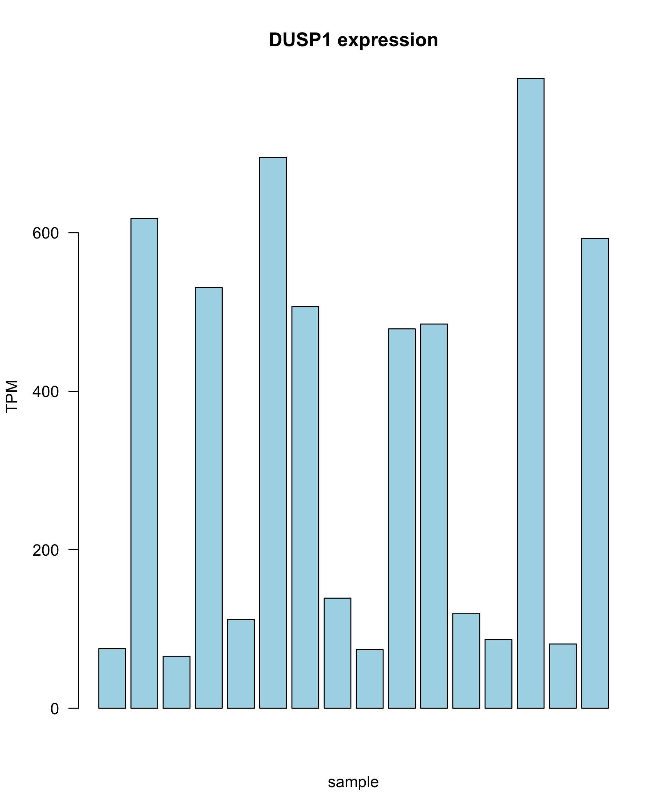
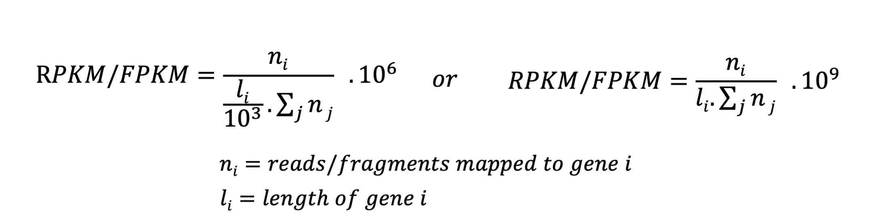

# Part 4 - Data normalization in RNA-seq

### Learning objectives:
- Learn the principles behind the major normalization strategies in RNA-seq
- Implement these normalization stratagies using custom R code

### Set-up

If you started a new R session, you must load in the `DESeq2` object we created in the previous lesson, which contains the counts and sample metadata.

```r
# load in the R object
dds <- readRDS("DESeq2.rds")
```

As we saw in the last lesson, the `counts()` function can be used to extract the matrix of raw read counts from the DESeq2 object:
```r
# load deseq2 package
library(DESeq2)

# extract counts
cts <- counts(dds, normalized=FALSE)
```
## Count normalization in RNA-seq

To compare expression levels between genes within a sample, or genes across multiple samples, it is critical the data is normalized to allow appropriate interpretation of the results. Which normalization strategy used depends on several factors such as library type, and type of comparison you wish to make (e.g. within- vs between-sample).

## Normalization methods

Several normalization methods exist for RNA-seq data. Which method you use depends on the comparison you are trying to make (e.g. between or within samples), therefore it is important to understand how each is calculated and when to use it.

### Counts per million (CPM)

CPM is a simple normalization method that involves scaling the number of reads mapped to a feature by the total number of reads in a sample. This fraction is multiplied by 1 million in order to provide the number of reads per million mapped in the sample.

<p align="center">

</p>

Calculate CPM for our dataset:
```r
# look at the counts object
head(cts)

# write a function that will calculate CPM
cpm <- function(counts) {
	cpm <- c()
	for(i in 1:length(counts)){
		cpm[i] <- counts[i] / sum(counts) * 1e6
	}
	cpm
}

# apply function to the columns of raw counts data
# we start at the third column because the first two columns have the ensemble IDs and gene names
cts_cpm <- apply(cts[, 3:5], 2, cpm)
## NOTE: we are calculating cpm for first 3 samples only to save time..
# add gene info columns back in
cts_cpm <- cbind(cts[, c(1,2)], cts_cpm)

# write to file
write.csv(cts_cpm, file="cts_CPM.csv")
```

**NOTE:** CPM does **NOT** normalize for gene length, therefore cannot be used to compare expression between different genes in the same sample. An exception to this rule would be in the case of 3'-end RNA-seq datasets, which have no gene length bias, therefore CPM would be appropriate for comparing expression between genes in the same sample in such data.

### Transcripts per million (TPM)

TPM has become a common normalization approach for RNA-seq data. Reads mapped to a feature (gene) are first normalized by the length of the feature (in kilobases), then divided by the total number of length normalized reads in the sample. Like CPM, reads are scaled per million.

<p align="center">

</p>

Since TPM normalizes for both gene length and sequencing depth, TPM values can be used to compare expression levels of genes within a sample, as well as between samples. TPM is recommended instead of RPKM/FPKM, for reasons we will discuss below.

Calculate TPM from our raw read counts:
```r
# read in gene lengths matrix (pre made for you)
gene_lengths <- read.table("data/gene-lengths-grch38.tsv", sep="\t", stringsAsFactors=FALSE, header=TRUE)

# look at the lengths object
head(gene_lengths)

# write a function that will calculate TPM
tpm <- function(counts, lengths) {
	rate <- counts / lengths
	tpm <- c()
	for(i in 1:length(counts)){
		tpm[i] <- rate[i] / sum(rate) * 1e6
	}
	tpm
}

# apply function to the columns of raw counts data
cts_tpm <- apply(cts[, 3:5], 2, tpm, gene_lengths$length)
## NOTE: we are calculating tpm for first 3 samples only to save time..

# add gene info columns back in
cts_tpm <- cbind(cts[, c(1,2)], cts_tpm)

# write to file
write.csv(cts_tpm, file="cts_TPM.csv")
```

Now you have a separate expression file containing all the normalized count values, and can be used to compare gene expression between samples, as well as between genes within a sample.

You could use this matrix to plot TPM values for some genes of interest. For example, the manuscript associated with these data ([Himes *et al*, 2014, *PloS One*](https://journals.plos.org/plosone/article?id=10.1371/journal.pone.0099625)) identifies *DUSP1* as a differentially expressed gene in their study. Lets plot DUSP1 TPM values to see if we can confirm this observation.

NOTE: Since we only calculated TPM for a subset of samples above (to save time) the example below will first load the complete TPM normalized dataset.

Visualize *DUSP1* TPM expression levels:
```R
# read in file containing all TPM counts (pre-made for you)
cts_tpm_full <- read.csv("data/all_counts_TPM-full.csv")

# get expression values for DUSP1 row
DUSP1_tpm <- cts_tpm_full[cts_tpm_full$gene_name=="DUSP1",]

# remove gene info columns
DUSP1_tpm <- DUSP1_tpm[ ,c(4:ncol(DUSP1_tpm))]

# convert to a numeric vector
DUSP1 <- as.numeric(DUSP1_tpm[1,])

# generate barplot of gene expression across samples
ppi=300
png("DUSP1_tpm.png")
barplot(DUSP1,
	col="lightblue", ylab="TPM", xlab="sample",
	main = "DUSP1 expression", las = 1)
dev.off()
```

<p align="center">

</p>

DUSP1 expression is clearly variable across the samples, suggesting differential expression across sample groups may exist (treated vs untreated). This can be tested statistically in a formal differential expression analysis (more about this later).


### Reads/fragments per kilobase of exon per million mapped reads (RPKM/FPKM)

RPKM and FPKM have been used for many years as normalization strategies in RNA-seq experiments. RPKM/FPKM are calculated in a very similar way to TPM, however the order of operations is essentially reversed. For RPKM and FPKM, reads are first normalized for sequencing depth, then gene length.

<p align="center">

</p>

The difference between RPKM and FPKM is very simple: RPKM is used for single-end experiments, whereas FPKM is used in paired-end experiments. This is because in single-end experiments we only measure one end of the DNA fragments in our library, however in paired-end experiments we measure the same DNA molecule 2x (once from each end), therefore we only need to count that fragment once during normalization, despite having 2 reads for it.

Since our dataset is paired-end and we counted the number of fragments in the quantification step, we are calculating FPKM. Calculate FPKM from our raw read counts:
```r
# write a function that will calculate FPKM
fpkm <- function(counts, lengths) {
	rate <- counts / lengths
	fpkm <- c()
	for(i in 1:length(counts)){
		fpkm[i] <- rate[i] / sum(counts) * 1e9
	}
	fpkm
}

# apply function to the columns of raw counts data
cts_fpkm <- apply(cts[, 3:5], 2, fpkm, gene_lengths$length)
## NOTE: we are calculating fpkm for first 3 samples only to save time..

# add gene info columns back in
cts_fpkm <- cbind(cts[, c(1,2)], cts_fpkm)

# write to file
write.csv(cts_fpkm, file="cts_FPKM.csv")
```

> REMEMBER: With RPKM/FPKM, the total number of normalized read counts per sample may be different, meaning it can be hard to compare proportions of reads for a specific gene between two samples (watch [this video](https://www.rna-seqblog.com/rpkm-fpkm-and-tpm-clearly-explained/), or return to the normalization lecture, for more details. We suggest TPM as a general purpose replacement for RPKM/FPKM.

-----

## Choose the most appropriate method for your dataset

The below table summarizes the normalization methods described above. It is important to learn when it is appropriate to apply each one to your dataset based on the comparisons you are trying to make.

**Method** | **Name** | **Accounts for** | **Appropriate comparisons**
-------|-------|-------|-------
CPM | Counts per million | Depth	 | - Between-sample<br>- Within experimental group
TPM | Transcripts per million | Depth & feature length | - Between- and within-sample<br>- Within experimental group
RPKM/FPKM | Reads/fragments per kilobase<br>of exon per million | Depth & feature length | - Within-sample<br>
DESeq2 | median-of-ratios | library size and composition | - Between-sample
